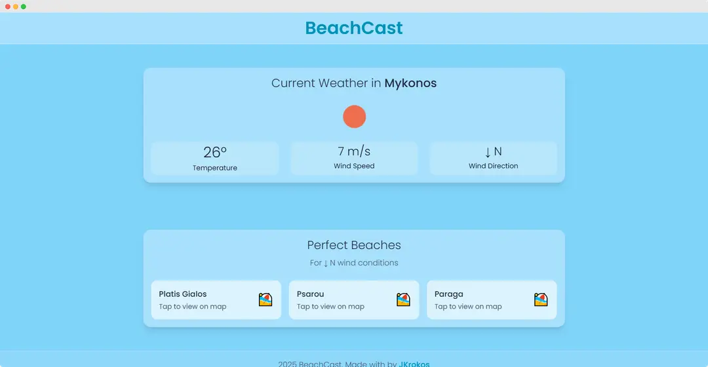

# BeachCast 🌊

A minimal, beautiful weather app that helps you find the perfect beach for your day. Built with React, TypeScript, and Tailwind CSS, BeachCast combines real-time weather data with beach recommendations based on wind conditions.



## 🚀 Features

- **Real-time Weather Data** - Get current temperature, wind speed, and direction
- **Beautiful UI** - Clean, minimal design with a beachy aesthetic
- **Responsive Design** - Works perfectly on desktop and mobile
- **Glass Morphism** - Modern UI with backdrop blur effects
- **Fast & Lightweight** - Built with Vite for lightning-fast performance

## 🛠️ Tech Stack

- **React 19** - Modern React with hooks and context
- **TypeScript** - Type-safe development
- **Tailwind CSS** - Utility-first styling
- **Vite** - Next-generation build tool
- **OpenWeatherMap API** - Real-time weather data

## 🏗️ Architecture

The app follows clean architecture principles with proper separation of concerns:

```
src/
├── components/     # Reusable UI components
├── contexts/       # React context for state management
├── hooks/          # Custom React hooks
├── services/       # API service layer
├── utils/          # Pure utility functions
├── types/          # TypeScript type definitions
└── data/           # Static data and constants
```

## 🚀 Getting Started

### Prerequisites

- Node.js 22.12+
- npm or yarn
- OpenWeatherMap API key

### Installation

1. **Clone the repository**

   ```bash
   git clone https://github.com/yourusername/beachcast.git
   cd beachcast
   ```

2. **Install dependencies**

   ```bash
   npm install
   ```

3. **Set up environment variables**

   ```bash
   cp .env.example .env
   ```

   Add your OpenWeatherMap API key to `.env`:

   ```
   VITE_API_KEY=your_openweathermap_api_key_here
   ```

4. **Start the development server**

   ```bash
   npm run dev
   ```

5. **Open your browser**
   Navigate to `http://localhost:5173`

## 🌍 API Setup

1. Visit [OpenWeatherMap](https://openweathermap.org/api)
2. Sign up for a free account
3. Generate an API key
4. Add it to your `.env` file

## 📱 Usage

1. **View Weather** - See current conditions for your location
2. **Get Beach Suggestions** - Receive recommendations based on wind direction
3. **Visit Beaches** - Tap any beach to view it on Google Maps

## 🤝 Contributing

Contributions are welcome! Feel free to:

- Report bugs
- Suggest new features
- Submit pull requests

## 👨‍💻 About

Built with ❤️ by [JKrokos](https://jkrokos.dev) - A passionate developer creating beautiful, functional web applications.

---

_Find your perfect beach day with BeachCast_ 🏖️
